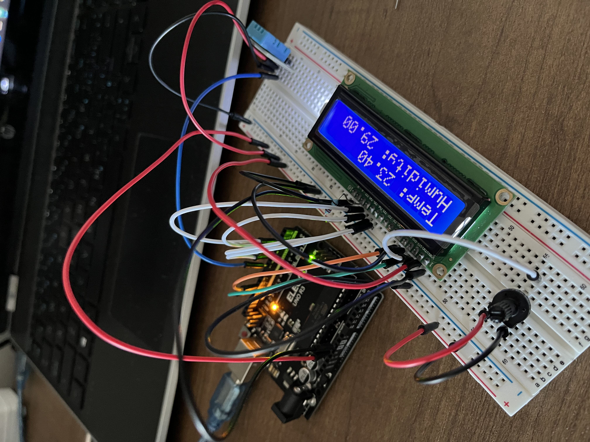

# Temperature and Humidity Monitoring System 

The system collects real time data from the DHT11 Temperature and Humidity Module and displays the data dynamically on the LCD module. The displayed data will update in response to changes in the temperature or humidity in real time. 

### Components used:
 - DHT11 Temperature and Humidity Module
 - LCD 1602 display module
 - Potentiometer 

## Images

